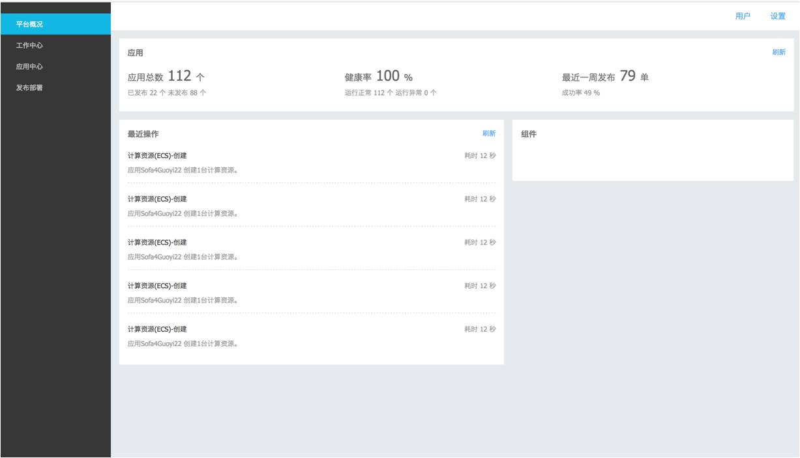

# 培训作业总览

## 蛇形矩阵
此题要求输入蛇形矩阵宽度N，输出整个蛇形矩阵结果，注意输出格式要求按照矩阵从上至下的依次按行输出，每行中间无需换行输出

样本输入： 3

样本输出： 1 2 3 8 9 4 7 6 5

## 新的Date类
完成一个类，此类继承自 Date，拥有Date的所有属性和对象，重写此类的getTime方法，返回当前时间格式为： YYYY-MM-DD， 例：2018-01-01

## 继承
实现一种继承 解决父层对象原型中共用会相互影响的问题，即解决原型对象中引用类型数据引起的问题

## 布局实现
;

## 模块
模仿 CommonJS 规范实现浏览器端模块系统

## webService 
实现三个进程的 StaticWebService(1 master, 2 slaver)

